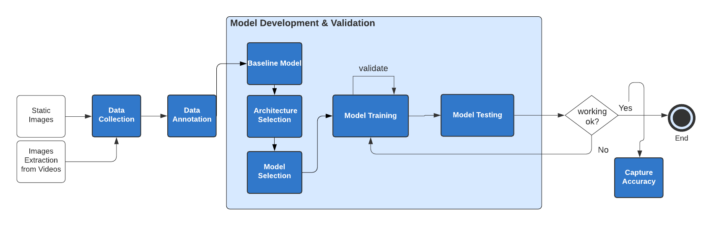
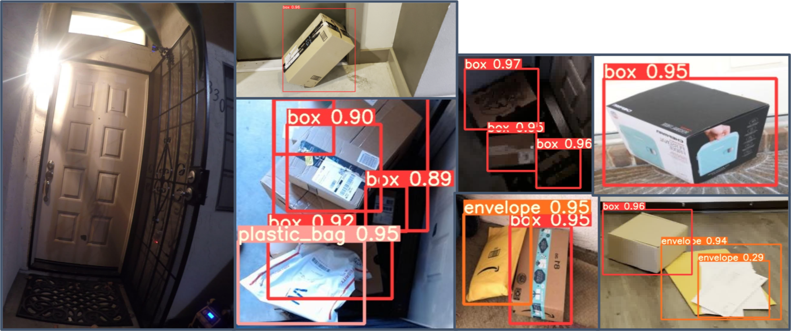

# Model Development and Validation

We built our baseline model on the unaugmented datasets and then used the predictions to measure the baseline's performance — this would then become what we compared any other machine learning algorithm against. We selected a network architecture by testing performance of default configurations on the unaugmented datasets and thereafter fine-tuned the best performing model to optimize its performance. After configuration selection, we trained our model on the full dataset with augmentation. Then, the performance of our fully trained model is evaluated on a testing images set. If it doesn’t perform well, we need to go back to the train and validate steps and conduct hyperparameter optimization or tuning. Otherwise, we capture the accuracy and the model is ready for the real-time package classification development on the NX edge, using a Kubernetes cluster.

## Architecture Selection

While YOLOv5 is dominant among object detection architectures (as of this writing), we wanted to ensure that there are no particulars of the package detection problem that render an alternate architecture particularly well-suited to this purpose. Broadly speaking, we wanted to test lightweight variants of the Single Shot Detector (SSD), Regions with CNN features (R-CNN), and You Only Look Once (YOLO) approaches. In order to quickly test both the practicality of use and predictive ability of these systems, we adapted default configurations of the [MobileNetSSDv2](https://blog.roboflow.com/training-a-tensorflow-object-detection-model-with-a-custom-dataset/), [FasterRCNN](https://blog.roboflow.com/training-a-tensorflow-faster-r-cnn-object-detection-model-on-your-own-dataset/), and [YOLOv5](https://blog.roboflow.com/how-to-train-yolov5-on-a-custom-dataset/) network architectures as outlined by Roboflow (see references) and trained them using our unaugmented dataset, which were each able to train on the provided data within 30 minutes. The mean average precision (mAP) metrics associated with each architecture at the 0.5 and 0.5:0.95 IOU levels are outlined in the table below:

| Architecture | mAP@0.5 | mAP@0.5:0.95 |
|--------------|---------|--------------|
| MobileNetSSD | 0.5214  | 0.8338       |
| Faster-RCNN  | 0.5305  | 0.8391       |
| YOLOv5       | 0.6059  | 0.9515       |

The maximal performance of YOLOv5 across both mAP metrics validated the common understanding of YOLOv5’s dominance in object detection, even when applied to the package detection use case. As such, we proceeded in training the model with the YOLOv5 architecture.

## Configuration Selection
The next step was to determine the ideal YOLOv5 configuration for the purpose of package detection. YOLOv5 includes 4 separate network configurations by default, named by their size—yolov5s (small), yolov5m (medium), yolov5l (large), and yolov5x (extra large), increasing in both performance and runtime in that order:

Given the time considerations involved with training the different configurations on the full, augmented dataset, we decided to first train the least and most complex variants for 100 epochs each to determine the increase in mAP associated with the larger network. The outcomes of this training are provided below:

| Configuration | Train Time (100 epochs) | mAP@0.5 | mAP@0.5:0.95 |
|---------------|-------------------------|---------|--------------|
| yolov5s       | 01:22:17                | 0.694   | 0.558        |
| yolov5x       | 07:20:30                | 0.688   | 0.551        |

The lightest model (yolov5s) unexpectedly performed slightly better than the heaviest model, (yolov5x), despite requiring upwards of 5x more time to train 100 epochs. As such, we decided that it would be best to proceed with yolov5s, given the reduced training time and the expected reduction in inference time as a result.

## Predictions

The predictions provided by the trained yolov5s model model were relatively accurate. As evidenced in the images below, the model met several key criteria for success, namely:

* Packages are not detected in images that do not contain them
* Packages positioned differently from those used in training
* Multiple overlapping bounding boxes
* Images taken in darkness
* Packages with colors not present in training data

Overall, this proved to be sufficiently capable of detecting packages in different settings, so we used this model in the live detection setting.
